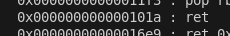

void show_slips(void)

{
  long lVar1;
  undefined8 uVar2;
  long in_FS_OFFSET;
  
  lVar1 = *(long *)(in_FS_OFFSET + 0x28);
  cprintf(5,&DAT_00102308);
  cprintf(4,"You unfold the first slip of paper. Written in an elegant script:\n");
  cprintf(3,&DAT_00102393,print_title);
  uVar2 = *(undefined8 *)(in_FS_OFFSET + 0x28);
  cprintf(5,&DAT_001023b0);
  cprintf(4,"The second slip contains a mysterious sequence of characters:\n");
  cprintf(3,&DAT_00102437,uVar2);
  cprintf(6,"You stare at these cryptic pieces of information, trying to make sense of them.\n");
  cprintf(6,"What could a pie location and a canary possibly have to do with finding a shell?\n\n");
  cprintf(0xb,"Press Enter to continue your quest...");
  getchar();
  if (lVar1 != *(long *)(in_FS_OFFSET + 0x28)) {
                    /* WARNING: Subroutine does not return */
    __stack_chk_fail();
  }
  return;
}

void write_notes(void)

{
  long in_FS_OFFSET;
  undefined local_58 [72];
  long local_10;
  
  local_10 = *(long *)(in_FS_OFFSET + 0x28);
  cprintf(9,&DAT_00102528);
  cprintf(8,"You decide to record your thoughts in your treasure hunting journal.\n");
  cprintf(8,"Perhaps writing down the right sequence will lead you to the shell...\n\n");
  cprintf(3,"Write your notes: ");
  __isoc99_scanf(&DAT_00102613,local_58);
  cprintf(10,"\nYou finish writing and close your journal. Something feels different now...\n");
  cprintf(0xb,"Press Enter to continue...");
  getchar();
  getchar();
  if (local_10 != *(long *)(in_FS_OFFSET + 0x28)) {
                    /* WARNING: Subroutine does not return */
    __stack_chk_fail();
  }
  return;
}

void shell(void)

{
  long lVar1;
  long in_FS_OFFSET;
  
  lVar1 = *(long *)(in_FS_OFFSET + 0x28);
  system("/bin/sh");
  if (lVar1 != *(long *)(in_FS_OFFSET + 0x28)) {
                    /* WARNING: Subroutine does not return */
    __stack_chk_fail();
  }
  return;
}

undefined8 main(void)

{
  long lVar1;
  long in_FS_OFFSET;
  
  lVar1 = *(long *)(in_FS_OFFSET + 0x28);
  setup();
  print_title();
  cprintf(7,"As you walk along the shore searching for the legendary shell...\n\n");
  cprintf(2,"A mysterious stranger approaches you on the beach at sunset.\n");
  cprintf(2,"\"I hear you seek the legendary shell,\" he says, his face obscured by a hood.\n");
  cprintf(2,"\"Finding it requires... unconventional knowledge.\"\n\n");
  cprintf(2,"He hands you two slips of paper before vanishing into the mist.\n");
  cprintf(0xb,"Press Enter to examine the papers...");
  getchar();
  show_slips();
  write_notes();
  cprintf(7,"\nYou continue your journey along the shore, the puzzle of the pie and canary\n");
  cprintf(7,"still lingering in your mind. Perhaps the answer will come to you soon...\n\n");
  if (lVar1 != *(long *)(in_FS_OFFSET + 0x28)) {
                    /* WARNING: Subroutine does not return */
    __stack_chk_fail();
  }
  return 0;
}
┌──(.venv)─(kali㉿kali)-[~/…/events/cyberthon/online/Pies, Canaries & Shells]
└─$ checksec --file=pies_canaries_and_shells 

RELRO           STACK CANARY      NX            PIE             RPATH      RUNPATH   Symbols         FORTIFY Fortified       Fortifiable FILE
Full RELRO      Canary found      NX enabled    PIE enabled     No RPATH   No RUNPATH   51 Symbols     No    0               2           pies_canaries_and_shells
                                                                     
┌──(.venv)─(kali㉿kali)-[~/…/events/cyberthon/online/Pies, Canaries & Shells]
└─$ python main.py      
Offset of print_title: 0x1539
Offset of shell:       0x14f8

╭───────────────────────────────────────────────────────────╮
│                                                           │
│  PIES, CANARIES, AND SHELLS                               │
│                                                           │
│  A peculiar tale of treasure hunting                      │
│                                                           │
╰───────────────────────────────────────────────────────────╯

As you walk along the shore searching for the legendary shell...

A mysterious stranger approaches you on the beach at sunset.
"I hear you seek the legendary shell," he says, his face obscured by a hood.
"Finding it requires... unconventional knowledge."

He hands you two slips of paper before vanishing into the mist.
Press Enter to examine the papers...

⊱ ───── The First Slip of Paper ───── ⊰

You unfold the first slip of paper. Written in an elegant script:
「 Pie Location: 0x560de619c539 」

⊱ ───── The Second Slip of Paper ───── ⊰

The second slip contains a mysterious sequence of characters:
「 Canary: 0xca2903d31a01d600 」

You stare at these cryptic pieces of information, trying to make sense of them.
What could a pie location and a canary possibly have to do with finding a shell?

Press Enter to continue your quest...

⊱ ───── Your Treasure Journal ───── ⊰

You decide to record your thoughts in your treasure hunting journal.
Perhaps writing down the right sequence will lead you to the shell...

Write your notes: 

Above is done after pressing enter twice as asked

Solution:

ROPgadget --binary pies_canaries_and_shells

Find ret gadget

payload is
buffer + stack canary + RBP (idk why) + RET gadget + ret address